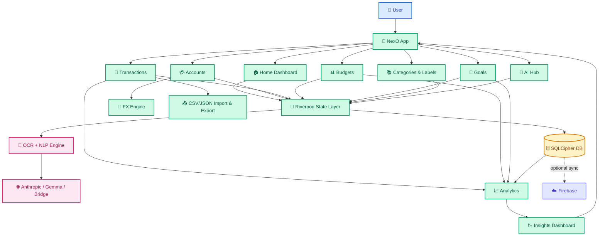

<div align="center">

# 💰 NexO

### _Smart Personal Finance — Reimagined_

<br>

[](https://flutter.dev)
[](https://dart.dev)
[](https://m3.material.io)
[](./LICENSE)


<br>

**NexO** is a polished, AI-powered Flutter finance app built for **clarity, control, and smarter money decisions.**  
Track income & expenses, manage budgets & goals, scan receipts with AI, and visualize your financial health — all with a beautiful Material 3 Expressive interface.

<br>

[Features](#-features) · [Architecture](#-architecture) · [Tech Stack](#-tech-stack) · [Getting Started](#-getting-started) · [Contributing](#-contributing)

---

</div>

<br>

## ✨ Features

<table>
<tr>
<td width="50%">

### 💳 Accounts & Net Worth
- Multi-account support (cash, bank, cards)
- Real-time balance tracking & transfers
- Net worth dashboard with currency conversion
- Account insights and history

</td>
<td width="50%">

### 📊 Budgets & Planning
- Weekly, monthly, yearly & custom budget cycles
- Category-specific budget limits with pacing
- Budget progress visualization
- Overspend alerts and forecasting

</td>
</tr>
<tr>
<td width="50%">

### 🧾 Smart Transactions
- Add income, expenses & transfers
- Quick-add flow (capture in under 15 seconds)
- Recurring payments & subscriptions
- Batch add, search, filter & tagging
- Debt tracking (lent/borrowed)

</td>
<td width="50%">

### 🤖 AI-Powered Intelligence
- Natural language capture (_"coffee ₹250 yesterday"_)
- Receipt OCR via camera/gallery (ML Kit + Vision)
- AI auto-categorization of transactions
- Spending insights & financial coaching
- On-device inference with Flutter Gemma

</td>
</tr>
<tr>
<td width="50%">

### 🎯 Goals & Savings
- Savings goals with contribution tracking
- Deadline management & suggested monthly targets
- Visual progress indicators
- Goal completion celebrations

</td>
<td width="50%">

### 📈 Analytics & Reports
- Date-range filters (7d / 30d / month / custom)
- Period-over-period comparisons
- Cashflow & category trend analysis
- Expense pie charts & spending line charts
- Smart insight cards (anomalies, budget risk)

</td>
</tr>
<tr>
<td width="50%">

### 🏷️ Categories & Labels
- Emoji & color-coded categories
- Subcategory support
- Custom labels/tags for granular organization
- Per-category spending breakdown

</td>
<td width="50%">

### 🔒 Security & Privacy
- Biometric & device-credential app lock
- Encrypted local database (SQLCipher)
- Secure secret storage
- All data stays on your device by default

</td>
</tr>
<tr>
<td width="50%">

### 📂 Data Portability
- CSV import & export
- Full JSON backup & restore
- Auto-backup on app launch
- Firebase cloud sync (optional)

</td>
<td width="50%">

### 🌍 Internationalization
- English & Spanish (es-MX) locale support
- Multi-currency with live exchange rates
- Cached FX rates with static fallback
- Localized date & number formatting

</td>
</tr>
</table>

<br>

### 🎨 Design Highlights

> Built with **Material 3 Expressive** design principles — not just another flat UI.

- 🎨 **Dynamic Color** — Adapts to your device's Material You wallpaper theme
- 🌗 **Dark & Light Mode** — With custom accent color selection
- ✨ **Expressive Motion** — Purposeful animations (150ms fast / 250ms standard / 380ms emphasized)
- 📐 **Design System** — Shared tokens for spacing, radius, typography & motion
- ♿ **Accessibility** — High contrast, semantic labels, minimum touch targets

<br>

---

## 🏗️ Architecture

NexO follows a **feature-first modular architecture** with clean separation between domain logic and presentation.

```
nexo/
├── lib/
│   ├── core/                    # Shared infrastructure
│   │   ├── ai/                  # LLM clients, AI config, provider catalog
│   │   ├── auth/                # Firebase authentication controller
│   │   ├── db/                  # SQLCipher local database layer
│   │   ├── firebase/            # Firebase bootstrap & Firestore paths
│   │   ├── fx/                  # Multi-currency exchange rate service
│   │   ├── i18n/                # Language settings & locale management
│   │   ├── notifications/       # Local notification service
│   │   ├── platform/            # Platform-specific notification access
│   │   ├── router/              # GoRouter navigation configuration
│   │   ├── security/            # App lock, biometrics, secret store
│   │   ├── theme/               # Material 3 theme configuration
│   │   ├── ui/                  # Entity palette & shared UI utilities
│   │   └── util/                # ID generation & helpers
│   │
│   ├── design_system/           # Material 3 Expressive design system
│   │   ├── components/          # 12 reusable DS components
│   │   └── tokens/              # Spacing, radius, motion, typography
│   │
│   ├── features/                # Feature modules (domain + presentation)
│   │   ├── accounts/            # Account management & net worth
│   │   ├── ai/                  # AI assistant, insights, planning
│   │   ├── analytics/           # Reports & date-range analytics
│   │   ├── budgets/             # Budget tracking & pacing
│   │   ├── capture/             # Smart auto-capture from notifications
│   │   ├── categories/          # Category management (emoji/color)
│   │   ├── data/                # Backup, CSV import/export
│   │   ├── documents/           # Document OCR & receipt scanning
│   │   ├── goals/               # Savings goals & contributions
│   │   ├── home/                # Dashboard with customizable modules
│   │   ├── labels/              # Tags & label management
│   │   ├── notifications/       # Reminders & payment alerts
│   │   └── transactions/        # Core transaction engine
│   │
│   ├── l10n/                    # Localization (EN, ES)
│   ├── app.dart                 # Root app widget
│   └── main.dart                # Entry point & bootstrap
│
├── test/                        # 25 unit & integration tests
├── android/                     # Android platform (Kotlin)
├── ios/                         # iOS platform (Swift)
├── linux/                       # Linux desktop platform
├── tools/                       # Nexo AI Bridge (Node.js)
├── docs/                        # Architecture & development docs
└── .github/                     # CI workflows & issue templates
```

<br>

### 📊 App Flow Diagram



<br>

---

## 🛠️ Tech Stack

| Layer | Technology | Purpose |
|-------|-----------|---------|
| **Framework** | Flutter 3.x | Cross-platform UI (Android, iOS, Linux) |
| **Language** | Dart 3.4+ | Type-safe, null-safe application logic |
| **Design** | Material 3 Expressive | Adaptive theming with dynamic color |
| **State** | Riverpod | Reactive, testable state management |
| **Navigation** | GoRouter | Declarative, URL-based routing |
| **Database** | SQLite + SQLCipher | Encrypted local persistence |
| **Charts** | fl_chart | Financial data visualization |
| **AI/ML** | Anthropic API, ML Kit, Flutter Gemma | NLP capture, OCR, on-device inference |
| **Auth** | Firebase Auth | Email/password + Google sign-in |
| **Cloud** | Cloud Firestore | Optional cloud sync & backup |
| **Analytics** | Firebase Analytics | Product event tracking |
| **Security** | local_auth, flutter_secure_storage | Biometric lock & secret storage |
| **Fonts** | Google Fonts | Premium typography (Inter, Roboto) |
| **Localization** | Flutter l10n (ARB) | Multi-language support |
| **CI/CD** | GitHub Actions | Automated testing & APK builds |

<br>

### 📦 Key Dependencies

```yaml
flutter_riverpod: ^2.6.1    # State management
go_router: ^14.8.1           # Navigation
sqlite3: ^3.3.0              # Local database
fl_chart: ^0.69.2            # Chart visualizations
dynamic_color: ^1.8.1        # Material You support
google_fonts: ^6.2.1         # Typography
firebase_core: ^3.15.2       # Firebase platform
firebase_auth: ^5.6.3        # Authentication
cloud_firestore: ^5.6.12     # Cloud database
flutter_gemma: ^0.16.0       # On-device AI
google_mlkit_text_recognition # OCR engine
pdfx: ^2.6.0                 # PDF rendering for AI vision
local_auth: ^2.3.0           # Biometric authentication
flutter_secure_storage: ^9.2.2 # Encrypted key-value store
```

<br>

---

## 🚀 Getting Started

### Prerequisites

| Requirement | Version |
|------------|---------|
| Flutter SDK | Stable channel |
| Dart SDK | 3.4+ (bundled with Flutter) |
| Android Studio / Xcode | For mobile development |
| Linux desktop deps | If targeting `-d linux` |

### Installation

```bash
# 1. Clone the repository
git clone https://github.com/sanyam-15/NexO.git
cd NexO

# 2. Install dependencies
flutter pub get

# 3. Run the app
flutter run
```

### Platform-Specific Commands

```bash
# Android
flutter run -d android

# iOS
flutter run -d ios

# Linux Desktop
flutter run -d linux

# Build release APK
flutter build apk --release

# Build release AAB (Play Store)
flutter build appbundle --release
```

<br>

---

## 🧪 Testing

NexO includes **25 test files** covering domain logic, database operations, and integration flows.

```bash
# Run all tests
flutter test

# Run with coverage
flutter test --coverage

# Static analysis
flutter analyze
```

### Test Coverage Areas

| Area | Tests |
|------|-------|
| Transactions | Batch operations, CSV parsing, flows |
| Accounts | Balance calculations, net worth |
| AI | Client integration, config secrets, modules, statements |
| Database | Encryption, schema migrations, local store guards |
| Finance | Budgets, debts, goals, currencies |
| Capture | Parser logic, layout, merchant memory |
| Documents | OCR client, document transactions |
| Data | Backup/restore, CSV portability, referential integrity |

<br>

---

## 🧰 Tooling

### Nexo AI Bridge

> Use your **Claude Code** or **OpenAI Codex** subscription as an AI backend for NexO — no API keys needed.

A lightweight Node.js server (`tools/nexo-ai-bridge/`) that bridges NexO's AI features to CLI-based AI tools. Supports:
- Android (Termux + proot-distro)
- Desktop (macOS, Linux)
- Auto-start on device boot

See [`tools/nexo-ai-bridge/README.md`](./tools/nexo-ai-bridge/README.md) for setup instructions.

<br>

---

## 🗺️ Roadmap

NexO is actively developed across multiple phases:

| Phase | Status | Highlights |
|-------|--------|------------|
| **Phase 0** — Foundation | ✅ Done | Flutter scaffold, Material 3, Riverpod, GoRouter |
| **Phase 1** — Core Finance MVP | ✅ Done | Transactions, dashboard, SQLite, budgets |
| **Phase 2** — Power Features | ✅ Done | Recurring, debts, multi-account, multi-currency |
| **Phase 2.5** — Expressive Design | ✅ Done | Design system, components, motion, accessibility |
| **Phase 3** — Analytics & Insights | ✅ Done | Reports, filters, comparisons, trend analysis |
| **Phase 4** — Data Portability | ✅ Done | CSV, JSON backup, migration versioning |
| **Phase 5** — Product Quality | 🔄 Active | Test suite, CI/CD, accessibility audit |
| **Phase 6** — Android Release | ✅ Done | Android config, signing, emulator QA |
| **Phase 7** — Firebase Platform | 🔄 Active | Auth, Firestore sync, Crashlytics |
| **Phase 8** — AI Integration | ✅ Done | NLP capture, OCR, insights, on-device AI |

📋 Full roadmap: [`docs/ROADMAP.md`](./docs/ROADMAP.md)

<br>

---

## 📖 Documentation

| Document | Description |
|----------|-------------|
| [`docs/DEVELOPMENT.md`](./docs/DEVELOPMENT.md) | Local setup, workflow, and quality checks |
| [`docs/FIREBASE_ARCHITECTURE.md`](./docs/FIREBASE_ARCHITECTURE.md) | Firebase data model, security rules, migration strategy |
| [`docs/ANDROID_RELEASE.md`](./docs/ANDROID_RELEASE.md) | Android build, signing, and release process |
| [`docs/ROADMAP.md`](./docs/ROADMAP.md) | Detailed phased product roadmap |
| [`lib/design_system/README.md`](./lib/design_system/README.md) | Design system principles & component catalog |
| [`lib/design_system/MOTION.md`](./lib/design_system/MOTION.md) | Motion choreography guide |
| [`CONTRIBUTING.md`](./CONTRIBUTING.md) | Contribution workflow & conventions |
| [`SECURITY.md`](./SECURITY.md) | Security vulnerability reporting |
| [`CODE_OF_CONDUCT.md`](./CODE_OF_CONDUCT.md) | Community code of conduct |

<br>

---

## 🤝 Contributing

Contributions are welcome! Please read the [Contributing Guide](./CONTRIBUTING.md) before submitting changes.

```bash
# Fork → Clone → Branch → Code → Test → PR

# Branch naming convention
feat/<topic>
fix/<topic>
refactor/<topic>

# Commit convention (Conventional Commits)
feat(scope): add new feature
fix(scope): resolve bug
docs(scope): update documentation
```

### Quality Checklist

- [ ] `flutter analyze` passes
- [ ] `flutter test` passes
- [ ] Conventional commits used
- [ ] Documentation updated (if needed)

<br>

---

## 📄 License

This project is licensed under the **MIT License** — see the [LICENSE](./LICENSE) file for details.

<br>

---

<div align="center">

### Built with ❤️ by [Sanyam Jain](https://github.com/sanyam-15)

<br>

**⭐ Star this repo if you find it useful!**

<br>

[](https://flutter.dev)
[](https://dart.dev)
[](https://firebase.google.com)

</div>
